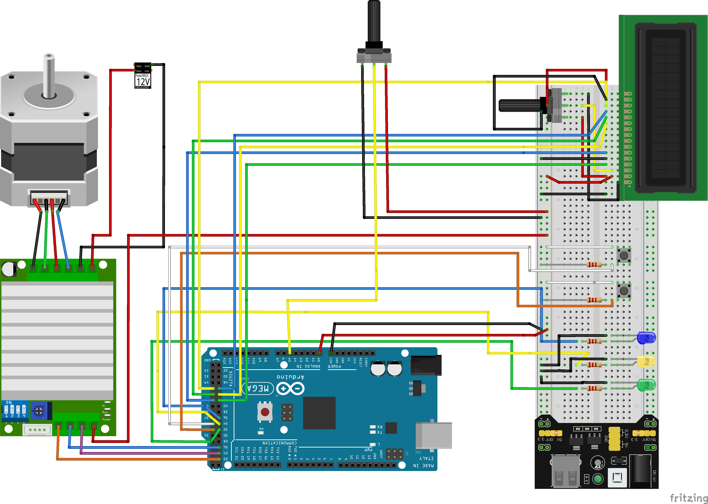

# Bomba de infusão

Implementa um protótipo de uma bomba de infusão utilizando um Arduino, um Motor de passo e lógica de programação.

> A bomba de infusão é um equipamento médico destinado à administração de fluidos, como medicamentos e nutrientes, que são entregues de forma controlada no corpo do paciente de acordo com sua prescrição médica. Desta forma, pacientes que necessitam de dosagens específicas de fluidos em um ritmo controlado podem contar com uma administração automatizada desses líquidos, sejam eles em pequenas ou grandes escalas. Com isso, além da precisão no envio dos fluidos, que é fundamental para a saúde e segurança do paciente, enfermeiros conseguem mais tempo para focar em outras atividades.

O procedimento implementado se resume nos seguintes passos:
* Leitura do volume a ser injetado, em mL
* Carregamento da seringa com base no volume indicado
* Leitura da vazão de descarga do líquido, em mL/s
* Descarregamento do volume com base na vazão indicada

## Circuito

### Lista de materiais
* 1x Placa Arduino Mega 2560 + Cabo USB
* 1x LCD 16x2 5V
* 2x Potenciômetro 10kΩ
* 1x Protoboard
* 3x Resistores de 220Ω
* 2x Resistores de 10kΩ
* 3x LEDs (verde, amarelo, azul)
* 2x Push Buttons
* 1x Motor de Passo Nema 23 -12,6 Kgf.cm/2,8A
* 1x Driver Motor de Passo - TB6600
* Jumpers